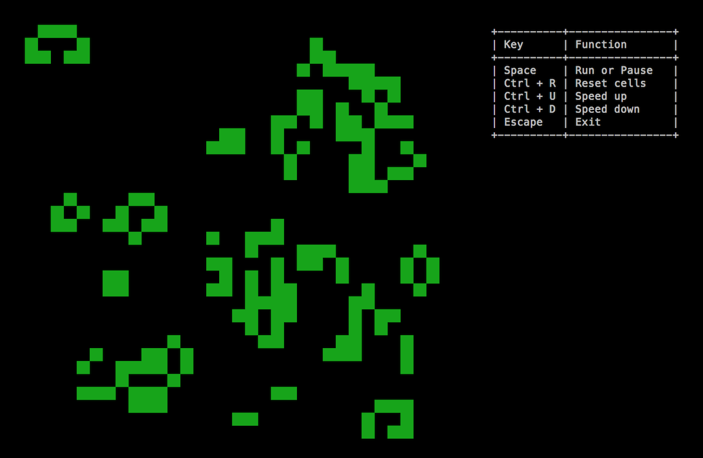

# golife

Conway's Game of Life created in golang.

It can run on the terminal.

## Control

* **Space**: Stop or Start.
* **Ctrl + R**: Reset cells
* **->**: Speed up
* **<-**: Speed down
* **Esc**: Exit

## Pattern

* **Shift + A**: Glider
* **Shift + B**: Glider Gun
* **Shift + C**: Galaxy
