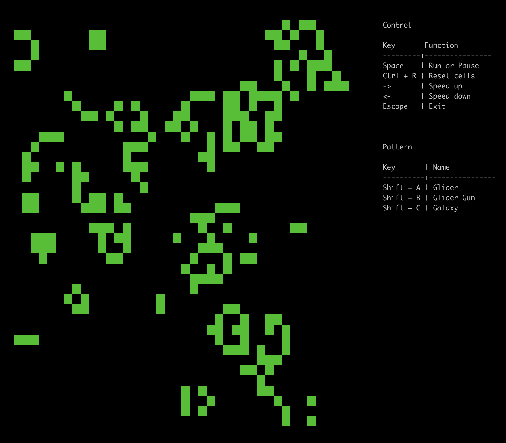

# golife

Conway's Game of Life created in golang.

It can run on the terminal.



## Install

Execute `go get` this repository.

## Usage

1. Open terminal app.

2. Run binary file.

    ```bash
    $ golife
    ```

### Control

* **Space**: Stop or Start.
* **Ctrl + R**: Reset cells
* **->**: Speed up
* **<-**: Speed down
* **Esc**: Exit

### Pattern

* **Shift + A**: Glider
* **Shift + B**: Glider Gun
* **Shift + C**: Galaxy

